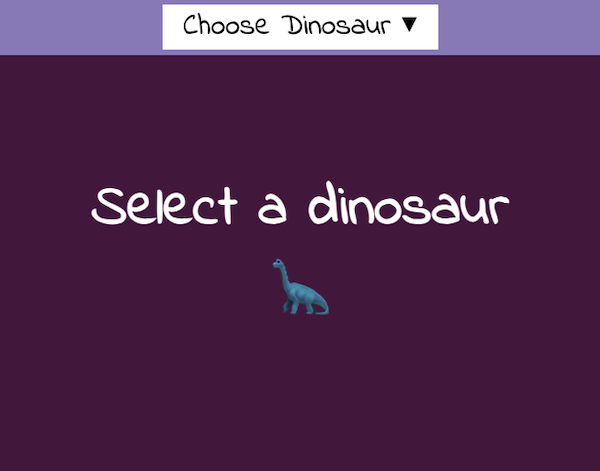

## Introduction

Dans ce projet, tu vas créer un site web de fan qui permet à un utilisateur de faire des choix qui changent le contenu de la page web ! Tu peux créer une page web avec du contenu sur différentes équipes sportives, marques de mode, émissions de télévision ou tout autre sujet dont toi et tes amis êtes fans !

Internet a été conçu pour créer des liens sur la **base d'intérêts communs** ! Du tout premiers forums de discussion jusqu’aux sites modernes comme Reddit, les gens aiment lire et discuter de leurs hobbys et formes de divertissement favoris !

Tu vas :

- Choisir trois options de couleurs et de contenu
- Utiliser des boutons, CSS et JavaScript pour modifier l'ensemble de la page web
- Utiliser le stockage local pour rendre le choix permanent

\--- no-print ---

\--- task ---

### Essaie !

[Voir à l'intérieur](https://editor.raspberrypi.org/en/projects/pick-your-favourite-football){:target="_blank"}

  
Suivre un sport est un excellent moyen de se faire des amis. Parfois, tu soutiens la même équipe, mais avec autant d'options, toi et tes amis pourraient soutenir des équipes différentes. Il s'agit d'un site web que vous pouvez tous utiliser. Clique sur le menu déroulant en haut pour changer d’équipe !

<iframe src="https://editor.raspberrypi.org/en/embed/viewer/pick-your-favourite-football" width="100%" height="900" frameborder="0" marginwidth="0" marginheight="0" allowfullscreen> 
</iframe>

  

\--- /task ---

### Trouve l'inspiration !

Tu devras faire quelques choix de conception pour créer ton site web de fan !

- Quel sera ton sujet général ?
- Quelles sont les trois options que tu proposeras aux utilisateurs ?
- Quels sont les trois éléments de contenu qui s’appliqueront à ces options ?

\--- task ---

Explore ces exemples de projets pour obtenir plus d'idées :

**Choisir ton dinosaure favori** : [voir à l'intérieur](https://editor.raspberrypi.org/en/projects/pick-your-favourite-dinosaur){:target="_blank"}

<iframe src="https://editor.raspberrypi.org/en/embed/viewer/pick-your-favourite-dinosaur" width="100%" height="1000" frameborder="0" marginwidth="0" marginheight="0" allowfullscreen> </iframe>

**Choisir ta décennie favorite** : [voir à l'intérieur](https://editor.raspberrypi.org/en/projects/pick-your-favourite-decade){:target="_blank"}

<iframe src="https://editor.raspberrypi.org/en/embed/viewer/pick-your-favourite-decade" width="100%" height="1000" frameborder="0" marginwidth="0" marginheight="0" allowfullscreen> </iframe>

\--- /task ---

\--- /no-print ---

\--- print-only ---

### Trouve l'inspiration

**Choisir ton dinosaure favori**

**Choisir ta décennie favorite**

\--- /print-only ---
