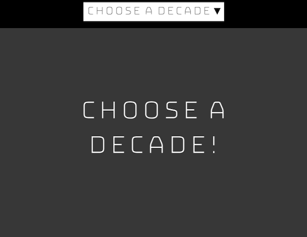

## Inleiding

In dit project maak je een fan website waarmee een gebruiker keuzes kan maken die de inhoud van de webpagina veranderen! Je kunt een webpagina maken met content over verschillende sportteams, modemerken, tv-programma's of iets anders waar jij en je vrienden fan van zijn!

Het internet is gebouwd om een band te creëren via **gedeelde interesses**! Van de eerste forums tot moderne sites als Reddit: mensen lezen en discussiëren graag over hun favoriete hobby's en vormen van entertainment!

Je gaat:

- Drie opties kiezen voor kleuren en inhoud
- Knoppen, CSS en JavaScript gebruiken om de hele webpagina te veranderen
- Lokale opslag gebruiken om de keuze definitief te maken

--- no-print ---

--- task ---

### Probeer het uit!

[Bekijk van binnen](https://editor.raspberrypi.org/nl-NL/projects/pick-your-favourite-football){:target="_blank"}

  
Het volgen van een sport is een geweldige manier om in contact te komen met vrienden. Soms ben je fan van hetzelfde team, maar door de vele keuzes kan het zijn dat jij en je vrienden verschillende teams steunen. Dit is een website die jullie allemaal kunnen gebruiken. Klik op het keuzelijst menu bovenaan om van team te wisselen!

<iframe src="https://editor.raspberrypi.org/nl-NL/embed/viewer/pick-your-favourite-football" width="100%" height="900" frameborder="0" marginwidth="0" marginheight="0" allowfullscreen> 
</iframe>

  

--- /task ---

### Doe inspiratie op!

Je gaat een aantal ontwerpkeuzes moeten maken om jouw fanwebsite te maken!

- Wat is je overkoepelende onderwerp?
- Welke drie opties geef je aan de gebruikers?
- Welke drie stukjes inhoud zullen van toepassing zijn op deze opties?

--- task ---

Bekijk deze voorbeelden om meer ideeën te krijgen:

**Kies je favoriete dinosaurus**: [Bekijk van binnen](https://editor.raspberrypi.org/nl-NL/projects/pick-your-favourite-dinosaur){:target="_blank"}

<iframe src="https://editor.raspberrypi.org/nl-NL/embed/viewer/pick-your-favourite-dinosaur" width="100%" height="1000" frameborder="0" marginwidth="0" marginheight="0" allowfullscreen> </iframe>

**Kies je favoriete decennium**: [Bekijk van binnen](https://editor.raspberrypi.org/nl-NL/projects/pick-your-favourite-decade){:target="_blank"}

<iframe src="https://editor.raspberrypi.org/nl-NL/embed/viewer/pick-your-favourite-decade" width="100%" height="1000" frameborder="0" marginwidth="0" marginheight="0" allowfullscreen> </iframe>

--- /task ---

--- /no-print ---

--- print-only ---

### Doe inspiratie op

**Kies je favoriete dinosaurus**

**Kies je favoriete decennium**

--- /print-only ---
