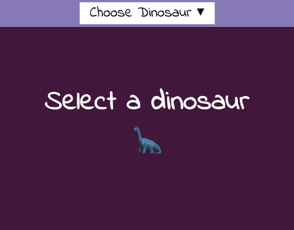

## 介绍

在这个项目中，你将创建一个粉丝网站，让用户可以通过做出选择来改变网页的内容！ 你可以制作一个网页，其中包含有关不同体育队伍、时尚品牌、电视节目或你和你的朋友所喜欢的任何其他内容的内容！

互联网诞生的目的就是在**共同兴趣**之间建立联系！ 从最早的留言板到 Reddit 等现代网站，人们喜欢阅读和讨论他们最喜欢的爱好和娱乐形式！

你将要：

- 为颜色和内容选择三个选项
- 使用按钮，CSS 和 JavaScript 来更改整个网页
- 使用本地存储使选择永久生效

--- no-print ---

--- task ---

### 试试吧！

[查看内部代码](https://editor.raspberrypi.org/zh-CN/projects/pick-your-favourite-football){:target="_blank"}

  
关注一项体育运动是与朋友联系的好方法。 有时你会支持同一支球队，但由于选择太多，你和你的队友可能会支持不同的球队。 这是一个大家都可以使用的网站。 点击顶部的下拉菜单即可切换队伍！

<iframe src="https://editor.raspberrypi.org/zh-CN/embed/viewer/pick-your-favourite-football" width="100%" height="900" frameborder="0" marginwidth="0" marginheight="0" allowfullscreen> 
</iframe>

  

--- /task ---

### 获得灵感！

你需要做一些设计选择来创建你的粉丝网站！

- 你的总体主题是什么？
- 你会给用户哪三个选项？
- 哪三部分内容适用于这些选项？

--- task ---

探索这些示例以获取更多灵感：

**选择你最喜欢的恐龙**: [查看内部代码](https://editor.raspberrypi.org/zh-CN/projects/pick-your-favourite-dinosaur){:target="_blank"}

<iframe src="https://editor.raspberrypi.org/zh-CN/embed/viewer/pick-your-favourite-dinosaur" width="100%" height="1000" frameborder="0" marginwidth="0" marginheight="0" allowfullscreen> </iframe>

**选择你最喜欢的年代**: [查看内部代码](https://editor.raspberrypi.org/zh-CN/projects/pick-your-favourite-decade){:target="_blank"}

<iframe src="https://editor.raspberrypi.org/zh-CN/embed/viewer/pick-your-favourite-decade" width="100%" height="1000" frameborder="0" marginwidth="0" marginheight="0" allowfullscreen> </iframe>

--- /task ---

--- /no-print ---

--- print-only ---

### 获得灵感

**选择你最喜欢的恐龙**

**选择你最喜欢的年代**

--- /print-only ---
